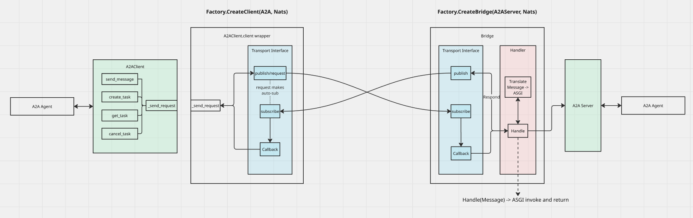

Agent Gateway SDK
========================
A multi-protocol gateway factory with variable transports and observability for agent-to-agent communication.

### Architecture

[]()

## Installation

This project uses [uv](https://github.com/astral-sh/uv) for package management:
```bash
# Install UV if you don't have it already
curl -LsSf https://astral.sh/uv/install.sh | sh
```

Create a new virtual environment and install the dependencies:
```bash
uv venv
source .venv/bin/activate
```

## Getting Started

Create an A2A client:
```python
from gateway_sdk.factory import GatewayFactory

factory = GatewayFactory()

default_client = factory.create_client("A2A", "http://localhost:8080")
client_over_nats = factory.create_client("A2A", "http://localhost:8080", transport="NATS")
```

## Testing

**Test the gateway factory with default A2A client/server**

Run a sample agent via an A2A server:
```bash
uv run python tests/helloworld/__main__.py 
```

Run an A2A test client:
```bash
uv run pytest tests/test_a2a.py::test_a2a_factory_client -s
```

**Test the gateway factory with A2A over NATS transport**

Run an A2A server with a NATS bridge:
```bash
uv run python tests/helloworld/__bridge__.py
```

Run a test for the A2A gateway with NATS transport:
```bash
uv run pytest tests/test_a2a.py::test_a2a_factory_client_with_transport -s
```

## Roadmap
- [ ] Add support for transport decoupling and usage
- [ ] Add additional protocols
- [ ] Add observability
- [ ] Add authentication and transport security
- [ ] Add AGP control plane integration
- [ ] Add traffic routing via AGP control plane
