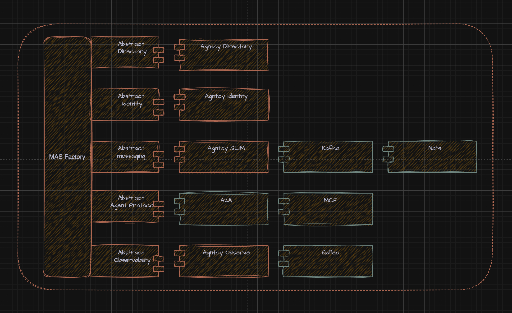

<div align='center'>

<h1>Agntcy Application SDK</h1>

<a href="https://agntcy.org">
  <picture>
    <source media="(prefers-color-scheme: dark)" srcset="assets/_logo-Agntcy_White@2x.png" width="300">
    
  </picture>
</a>

<p><i>Build interoperable multi-agent systems for the Internet of Agents</i></p>

[](https://pypi.org/project/agntcy-app-sdk/)
[](https://github.com/agntcy/app-sdk/LICENSE)
[](https://www.python.org/downloads/)

</div>
<div align="center">
  <div style="text-align: center;">
    <a target="_blank" href="#quick-start" style="margin: 0 10px;">Quick Start</a> •
    <a target="_blank" href="#transport--protocol-support" style="margin: 0 10px;">Transports & Protocols</a> •
    <a target="_blank" href="#architecture" style="margin: 0 10px;">Architecture</a> •
    <a target="_blank" href="docs/API_REFERENCE.md" style="margin: 0 10px;">API Reference</a> •
    <a target="_blank" href="#contributing" style="margin: 0 10px;">Contributing</a>
  </div>
</div>

</div>

## Overview

The Agntcy Application SDK provides a unified factory interface for building interoperable, multi-agent components. It defines standard abstractions and interoperability layers that connect Agntcy and open-source transports, protocols, and directories — enabling agents to communicate and coordinate seamlessly.

It is intended as an integration and learning surface primarily used in [coffeeAgntcy](https://github.com/agntcy/coffeeAgntcy), not as a canonical or prescriptive SDK for AGNTCY subsystems. Standards and reference guidance remain the responsibility of the working groups. Please see the respective components for their latest SDK or interfaces.

### Features

<table>
<tr>
<td width="25%" valign="top">

**🔌 Semantic Layer**

- A2A protocol (point-to-point, broadcast, group chat)
- MCP and FastMCP protocol bridges
- Transport-agnostic — same API across all transports

</td>
<td width="25%" valign="top">

**🚀 Transport Layer**

- SLIM (SlimRPC + SLIM patterns)
- NATS (NATS patterns)
- Automatic transport negotiation

</td>
<td width="25%" valign="top">

**📂 Directory**

- Agntcy Directory integration
- Agent Record Push / Pull / Search
- OASF ↔ AgentCard conversion

</td>
<td width="25%" valign="top">

**🔐 Identity**

- Access token management
- Shared secret & JWT identity providers
- Auth middleware (A2A, FastMCP)

</td>
</tr>
<tr>
<td colspan="4" align="center">

**🔍 Observability** • Built-in Agntcy Observe SDK integration

</td>
</tr>
</table>

## 📦 Installation

```bash
# Install via pip
pip install agntcy-app-sdk

# Or for uv based projects
uv add agntcy-app-sdk

# Install from source
git clone https://github.com/agntcy/app-sdk.git
pip install -e app-sdk
```

---

## Quick Start

The Application SDK provides a single factory interface that abstracts over multiple semantic protocols and transports, so you can switch between them without rewriting your agent logic. Full usage guides: **[A2A](docs/A2A_USAGE_GUIDE.md)** · **[MCP / FastMCP](docs/MCP_USAGE_GUIDE.md)**

|               | Protocol | Transport                     | Client Type             | Patterns                                  |
| ------------- | -------- | ----------------------------- | ----------------------- | ----------------------------------------- |
| **Section 1** | A2A      | Card-driven (multi-transport) | —                       | All (via `add_a2a_card()`)                |
| **Section 2** | A2A      | SlimRPC                       | `a2a.client.Client`     | Point-to-point                            |
| **Section 3** | A2A      | SLIM patterns / NATS patterns | `A2AExperimentalClient` | Point-to-point, broadcast                 |
| **Section 4** | A2A      | SLIM patterns                 | `A2AExperimentalClient` | Group chat                                |
| **Section 5** | MCP      | SLIM / NATS                   | `MCPClientSession`      | Point-to-point                            |
|               | FastMCP  | SLIM / NATS                   | `FastMCPClient`         | [Point-to-point](docs/MCP_USAGE_GUIDE.md) |

**SlimRPC** is the native A2A-over-SLIM RPC transport — simplest setup for 1:1 request/response. **SLIM patterns** and **NATS patterns** are experimental transports that unlock pub/sub fan-out and moderated group chat via the same `AgntcyFactory` interface. The factory negotiates the best transport automatically from the agent card.

> **Running examples:** Save any snippet as a `.py` file and run with `uv run python my_script.py`. The SDK is async — wrap top-level `await` calls in `asyncio.run(main())`.

---

## 1. Serve an A2A Agent

Declare your agent's transports in the card and serve over all of them with a single call:

```python
from a2a.types import AgentCapabilities, AgentCard, AgentInterface, AgentSkill
from a2a.server.request_handlers import DefaultRequestHandler
from a2a.server.tasks import InMemoryTaskStore
from agntcy_app_sdk.factory import AgntcyFactory
from agntcy_app_sdk.semantic.a2a.server.card_bootstrap import InterfaceTransport

# Declare transports in the card — this is the single source of truth
agent_card = AgentCard(
    name="My Agent", url="", version="1.0.0",
    defaultInputModes=["text"], defaultOutputModes=["text"],
    capabilities=AgentCapabilities(streaming=True), skills=[...],
    preferredTransport=InterfaceTransport.SLIM_PATTERNS,
    additional_interfaces=[
        AgentInterface(transport=InterfaceTransport.SLIM_RPC,
                       url="slim://localhost:46357/default/default/My_Agent_rpc"),
        AgentInterface(transport=InterfaceTransport.SLIM_PATTERNS,
                       url="slim://localhost:46357/default/default/My_Agent_slimpatterns"),
        AgentInterface(transport=InterfaceTransport.NATS_PATTERNS,
                       url="nats://localhost:4222/default/default/My_Agent_natspatterns"),
    ],
    description="My agent description",
)

# One call does it all — add_a2a_card() reads the card's interfaces
factory = AgntcyFactory()
session = factory.create_app_session(max_sessions=10)
await (
    session.add_a2a_card(agent_card, DefaultRequestHandler(
        agent_executor=MyAgentExecutor(), task_store=InMemoryTaskStore()))
    .start(keep_alive=True)
)
```

<details>
<summary><b>Alternative: Serve a single transport manually (SlimRPC)</b></summary>

```python
from agntcy_app_sdk.factory import AgntcyFactory
from agntcy_app_sdk.semantic.a2a.server.srpc import A2ASlimRpcServerConfig, SlimRpcConnectionConfig
from a2a.server.request_handlers import DefaultRequestHandler
from a2a.server.tasks import InMemoryTaskStore

config = A2ASlimRpcServerConfig(
    agent_card=agent_card,
    request_handler=DefaultRequestHandler(
        agent_executor=MyAgentExecutor(),
        task_store=InMemoryTaskStore(),
    ),
    connection=SlimRpcConnectionConfig(
        identity="default/default/my_agent",
        shared_secret="my-shared-secret-at-least-32-characters-long",
        endpoint="http://localhost:46357",
    ),
)

factory = AgntcyFactory()
session = factory.create_app_session(max_sessions=1)
session.add(config).with_session_id("default").build()
await session.start_all_sessions(keep_alive=True)
```

</details>

📖 [More serving options →](docs/A2A_USAGE_GUIDE.md)

## 2. Connect to an Agent

Configure all transports once, then let the factory negotiate the best one from the agent card:

```python
from a2a.types import Message, Part, Role, TextPart
from agntcy_app_sdk.semantic.a2a.client.factory import A2AClientFactory
from agntcy_app_sdk.semantic.a2a.client.config import (
    ClientConfig, SlimRpcConfig, SlimTransportConfig, NatsTransportConfig,
)

# Multi-transport config — factory picks the right one from the agent card
config = ClientConfig(
    slimrpc_config=SlimRpcConfig(
        namespace="default",
        group="default",
        name="my_client",
        slim_url="http://localhost:46357",
        secret="my-shared-secret-at-least-32-characters-long",
    ),
    slim_config=SlimTransportConfig(
        endpoint="http://localhost:46357",
        name="default/default/my_client",
        shared_secret_identity="my-shared-secret-at-least-32-characters-long",
    ),
    nats_config=NatsTransportConfig(
        endpoint="nats://localhost:4222",
    ),
)

# Create the factory — supports slimrpc, slimpatterns, natspatterns, and JSONRPC
a2a = A2AClientFactory(config)

# Create a client — factory reads the card's preferred_transport and negotiates
client = await a2a.create(agent_card)

# Send a message and stream the response
request = Message(
    role=Role.user,
    message_id="msg-001",
    parts=[Part(root=TextPart(text="Hello, agent!"))],
)
async for event in client.send_message(request=request):
    if isinstance(event, Message):
        for part in event.parts:
            if isinstance(part.root, TextPart):
                print(part.root.text)
```

<details>
<summary><b>Alternative: Connect with a single transport (SlimRPC only)</b></summary>

```python
from a2a.client import ClientFactory, minimal_agent_card
from a2a.types import Message, Part, Role, TextPart
from slima2a import setup_slim_client
from slima2a.client_transport import (
    ClientConfig as SRPCClientConfig,
    SRPCTransport,
    slimrpc_channel_factory,
)

# Set up the SLIM connection
service, slim_app, local_name, conn_id = await setup_slim_client(
    namespace="default", group="default", name="my_client",
    slim_url="http://localhost:46357",
)

# Create A2A client via upstream ClientFactory + SRPCTransport
config = SRPCClientConfig(
    supported_transports=["slimrpc"],
    slimrpc_channel_factory=slimrpc_channel_factory(slim_app, conn_id),
)
client_factory = ClientFactory(config)
client_factory.register("slimrpc", SRPCTransport.create)

card = minimal_agent_card("default/default/my_agent", ["slimrpc"])
client = client_factory.create(card=card)
```

</details>

📖 [Complete A2A guide →](docs/A2A_USAGE_GUIDE.md)

## 3. Broadcast to Many Agents

Fan out a single request to N agents simultaneously. Broadcast uses the **SLIM patterns** or **NATS patterns** transport (not SlimRPC) — the factory returns an `A2AExperimentalClient` with `broadcast_message()` when transport negotiation selects `slimpatterns` or `natspatterns`.

<details>
<summary><b>Broadcast example (SLIM patterns)</b></summary>

```python
import uuid
from a2a.types import (
    AgentCapabilities, AgentCard, Message, MessageSendParams, SendMessageRequest,
)

from agntcy_app_sdk.factory import AgntcyFactory
from agntcy_app_sdk.semantic.a2a.client.config import ClientConfig, SlimTransportConfig
from agntcy_app_sdk.semantic.a2a.server.card_bootstrap import InterfaceTransport

factory = AgntcyFactory()

# SLIM patterns transport — creates an A2AExperimentalClient
# (swap SlimTransportConfig for NatsTransportConfig + nats:// scheme for NATS)
config = ClientConfig(
    slim_config=SlimTransportConfig(
        endpoint="http://localhost:46357",
        name="default/default/broadcaster",
    ),
)
card = AgentCard(
    name="default/default/agent1",
    url="slim://default/default/agent1",
    version="1.0.0",
    default_input_modes=["text"],
    default_output_modes=["text"],
    capabilities=AgentCapabilities(),
    skills=[],
    preferred_transport=InterfaceTransport.SLIM_PATTERNS,
    description="Agent 1",
)

client = await factory.a2a(config).create(card)

request = SendMessageRequest(
    id=str(uuid.uuid4()),
    params=MessageSendParams(
        message=Message(
            role="user",
            parts=[{"type": "text", "text": "Status check"}],
            messageId=str(uuid.uuid4()),
        ),
    ),
)

# Fan-out to 3 agents at once
responses = await client.broadcast_message(
    request,
    broadcast_topic="status_channel",
    recipients=[
        "default/default/agent1",
        "default/default/agent2",
        "default/default/agent3",
    ],
)

for resp in responses:
    print(f"Response: {resp}")

# Streaming variant — yields each response as it arrives
async for resp in client.broadcast_message_streaming(
    request,
    broadcast_topic="status_channel",
    recipients=[
        "default/default/agent1",
        "default/default/agent2",
        "default/default/agent3",
    ],
    message_limit=3,
):
    print(f"Streaming response: {resp}")
```

</details>

## 4. Run a Group Chat

Start a moderated multi-party conversation between agents. Each participant processes the message and forwards it to the next. Group chat uses the **SLIM patterns** transport — the same `A2AExperimentalClient` from above.

> **Note:** Group chat currently requires SLIM transport.

<details>
<summary><b>Group chat example (SLIM patterns)</b></summary>

```python
import uuid
from a2a.types import (
    AgentCapabilities, AgentCard, Message, MessageSendParams, SendMessageRequest,
)

from agntcy_app_sdk.factory import AgntcyFactory
from agntcy_app_sdk.semantic.a2a.client.config import ClientConfig, SlimTransportConfig
from agntcy_app_sdk.semantic.a2a.server.card_bootstrap import InterfaceTransport

factory = AgntcyFactory()

# SLIM patterns transport — creates an A2AExperimentalClient
config = ClientConfig(
    slim_config=SlimTransportConfig(
        endpoint="http://localhost:46357",
        name="default/default/moderator",
    ),
)
card = AgentCard(
    name="default/default/agent_a",
    url="slim://default/default/agent_a",
    version="1.0.0",
    default_input_modes=["text"],
    default_output_modes=["text"],
    capabilities=AgentCapabilities(),
    skills=[],
    preferred_transport=InterfaceTransport.SLIM_PATTERNS,
    description="Agent A",
)

client = await factory.a2a(config).create(card)

request = SendMessageRequest(
    id=str(uuid.uuid4()),
    params=MessageSendParams(
        message=Message(
            role="user",
            parts=[{"type": "text", "text": "Plan a team lunch"}],
            messageId=str(uuid.uuid4()),
        ),
    ),
)

# Non-streaming group chat — collects all messages then returns
responses = await client.start_groupchat(
    init_message=request,
    group_channel="lunch_planning",
    participants=["default/default/agent_a", "default/default/agent_b"],
    end_message="DELIVERED",
    timeout=60,
)

for resp in responses:
    print(f"Group message: {resp}")

# Streaming group chat — yields each message as it arrives
async for message in client.start_streaming_groupchat(
    init_message=request,
    group_channel="lunch_planning",
    participants=["default/default/agent_a", "default/default/agent_b"],
    end_message="DELIVERED",
    timeout=60,
):
    print(f"Live: {message}")
```

</details>

## 5. Use MCP Tools over a Transport

Connect to a remote MCP server and call its tools — same transport layer as A2A, different protocol:

```python
import asyncio
from agntcy_app_sdk.factory import AgntcyFactory

factory = AgntcyFactory()

# Create a transport (swap "SLIM" for "NATS" + endpoint to switch)
transport = factory.create_transport(
    "SLIM", endpoint="http://localhost:46357", name="default/default/mcp_client"
)

async def main():
    mcp_client = await factory.mcp().create_client(
        topic="my_weather_agent.mcp",
        transport=transport,
    )

    async with mcp_client as client:
        tools = await client.list_tools()
        print("Available tools:", tools)

        result = await client.call_tool(
            name="get_forecast",
            arguments={"location": "Colombia"},
        )
        print(f"Forecast: {result}")

    await transport.close()

asyncio.run(main())
```

📖 [Complete MCP & FastMCP guide →](docs/MCP_USAGE_GUIDE.md)

---

## Transport & Protocol Support

The SDK negotiates the best transport automatically by intersecting the server's `AgentCard` transports with your `ClientConfig` capabilities. When the winning transport is `slimpatterns` or `natspatterns`, the factory returns an `A2AExperimentalClient` that extends the standard `Client` with broadcast and group-chat methods.

| Pattern                  | SLIM | NATS | Description                                                |
| ------------------------ | :--: | :--: | ---------------------------------------------------------- |
| **Point-to-Point**       |  ✅  |  ✅  | Standard 1:1 `send_message()` over transport               |
| **Broadcast**            |  ✅  |  ✅  | 1:N fan-out via `broadcast_message()`                      |
| **Broadcast Streaming**  |  ✅  |  ✅  | Streaming variant via `broadcast_message_streaming()`      |
| **Group Chat**           |  ✅  |  —   | Multi-party moderated conversation via `start_groupchat()` |
| **Group Chat Streaming** |  ✅  |  —   | Streaming variant via `start_streaming_groupchat()`        |

---

## Architecture

### Layered Architecture

```
┌─────────────────────────────────────────────────────────────┐
│                        AgntcyFactory                        │
│                 factory = AgntcyFactory()                   │
│                                                             │
│  factory.a2a(config)        → A2AClientFactory              │
│  factory.mcp()              → MCPClientFactory              │
│  factory.fast_mcp()         → FastMCPClientFactory          │
│  factory.create_transport("SLIM"|"NATS", ...)               │
│  factory.create_app_session(max_sessions=10)                │
└──────┬──────────────────┬──────────────────┬────────────────┘
       │                  │                  │
       ▼                  ▼                  ▼
┌──────────────┐  ┌───────────────────┐  ┌─────────────────────┐
│  Transport   │  │  Protocol Client  │  │     AppSession      │
│    Layer     │  │      Layer        │  │  (server-side)      │
│              │  │                   │  │                     │
│ BaseTransport│  │ a2a.client.Client │  │ .add(target)        │
│  ├ SLIM      │  │  (SlimRPC p2p)    │  │ .with_transport()   │
│  ├ NATS      │  │                   │  │ .with_topic()       │
│  └ HTTP      │  │ A2AExperimental-  │  │ .with_session_id()  │
│              │  │   Client          │  │ .build()            │
│ SlimRPC      │  │  (SLIM/NATS       │  │                     │
│  (native A2A │  │   patterns)       │  │ Targets:            │
│   transport) │  │                   │  │ ├ A2AStarlette      │
│              │  │ MCPClientSession  │  │ ├ A2ASlimRpcServer │
│ 3 Mixins:    │  │ FastMCPClient     │  │ ├ MCP Server        │
│  ├ P2P       │  └───────────────────┘  │ └ FastMCP           │
│  ├ FanOut    │                         └─────────────────────┘
│  └ GroupChat │
└──────────────┘
```

### Card-Driven Bootstrap (Recommended)

`add_a2a_card()` reads the agent card's `additional_interfaces` and creates all transports automatically — no manual builder chains required:

```python
from agntcy_app_sdk.semantic.a2a.server.card_bootstrap import InterfaceTransport

agent_card = AgentCard(
    ...,
    additional_interfaces=[
        AgentInterface(transport=InterfaceTransport.SLIM_PATTERNS, url="slim://host:46357/topic"),
        AgentInterface(transport=InterfaceTransport.NATS_PATTERNS, url="nats://host:4222/topic"),
        AgentInterface(transport=InterfaceTransport.JSONRPC, url="http://0.0.0.0:9000"),
    ],
)

session = factory.create_app_session(max_sessions=10)
await (
    session.add_a2a_card(agent_card, request_handler)
    .with_factory(factory)
    .skip("jsonrpc")              # optionally skip a transport
    .start(keep_alive=True)
)
```

| Method                           | Description                                                              |
| -------------------------------- | ------------------------------------------------------------------------ |
| `.with_factory(factory)`         | Reuse an existing `AgntcyFactory` (auto-created if omitted)              |
| `.with_shared_secret(secret)`    | Provide SLIM shared secret directly (falls back to `SLIM_SHARED_SECRET`) |
| `.skip(transport_type)`          | Exclude a specific transport from being started                          |
| `.override(transport_type, obj)` | Supply a pre-built transport or config for an interface                   |
| `.dry_run()`                     | Return a `ServeCardPlan` describing what _would_ start                   |
| `.start(keep_alive=False)`       | Build all containers and start sessions                                  |

### Manual Session Builder

The `AppSession` builder chains configuration into a single readable expression for fine-grained single-transport control. The SDK auto-detects the handler type from the target you pass to `add()`:

| Target Type                  | Handler Created                | Transport Required? |
| ---------------------------- | ------------------------------ | :-----------------: |
| `A2AStarletteApplication`    | `A2AExperimentalServerHandler` |         Yes         |
| `A2AStarletteApplication`    | `A2AJsonRpcServerHandler`      |      No (HTTP)      |
| `A2ASlimRpcServerConfig`     | `A2ASRPCServerHandler`         |    No (internal)    |
| `mcp.server.lowlevel.Server` | `MCPServerHandler`             |         Yes         |
| `mcp.server.fastmcp.FastMCP` | `FastMCPServerHandler`         |         Yes         |

```python
factory = AgntcyFactory()
session = factory.create_app_session(max_sessions=3)

# A2A over SLIM patterns
session.add(a2a_server) \
    .with_transport(slim_transport) \
    .with_topic("my_agent") \
    .with_session_id("a2a") \
    .build()

# A2A over SlimRPC (transport managed internally)
session.add(a2a_srpc_config) \
    .with_session_id("slimrpc") \
    .build()

# A2A over HTTP (no transport needed)
session.add(a2a_server) \
    .with_host("0.0.0.0") \
    .with_port(9000) \
    .with_session_id("http") \
    .build()

# Start everything
await session.start_all_sessions(keep_alive=True)
```

### Observability

Enable distributed tracing across all A2A and SLIM operations with a single flag:

```python
factory = AgntcyFactory(enable_tracing=True)
```

This initialises the [Agntcy Observe SDK](https://github.com/agntcy/observe) (OpenTelemetry-based) and auto-instruments SLIM transports and A2A client calls. Traces are exported to the configured `OTLP_HTTP_ENDPOINT` (default: `http://localhost:4318`).

---

## 📁 Project Structure

```
📁 src/
└── 📦 agntcy_app_sdk/
    ├── 🏭 factory.py            # Main factory interface
    ├── 🔄 app_sessions.py       # Session management & fluent builder
    ├── 📂 directory/            # Agent directory services
    ├── 🔐 identity/             # Authentication & identity
    ├── 🧠 semantic/             # Protocol layer
    │   ├── a2a/                 #   A2A protocol + experimental patterns
    │   ├── mcp/                 #   MCP protocol bridge
    │   └── fast_mcp/            #   FastMCP protocol bridge
    ├── 🌐 transport/            # Transport implementations
    │   ├── slim/                #   SLIM (Secure Low-Latency Interactive Messaging)
    │   ├── nats/                #   NATS messaging
    │   └── streamable_http/     #   HTTP-based transport
    └── 🛠️  common/              # Shared utilities & logging
```

# Reference Application

<a href="https://github.com/agntcy/coffeeAgntcy">
  
</a>

For a fully functional distributed multi-agent sample app, check out our [coffeeAgntcy](https://github.com/agntcy/coffeeAgntcy)!

# Agntcy Component Usage

<a href="https://github.com/agntcy/coffeeAgntcy">
  
</a>

| Component       | Version  | Description                                                                                                                                                                                  | Repo                                                 |
| --------------- | -------- | -------------------------------------------------------------------------------------------------------------------------------------------------------------------------------------------- | ---------------------------------------------------- |
| **SLIM**        | `1.0.0`  | Secure Low-Latency Interactive Messaging (SLIM) facilitates communication between AI agents using request-reply and moderated group-chat patterns.                                           | [Repo](https://github.com/agntcy/slim)               |
| **Observe SDK** | `1.0.34` | Enables multi-agent observability by setting `enable_tracing=True` when initializing the `AgntcyFactory`. This automatically configures tracing and auto-instrumentation for SLIM and A2A.   | [Repo](https://github.com/agntcy/observe/tree/main)  |
| **Directory**   | `1.0.0`  | Agent discovery and registration via the Agntcy Directory service. Push, pull, and search agent records with automatic OASF ↔ AgentCard conversion. Integrated into `AppSession` lifecycle. | [Repo](https://github.com/agntcy/dir)                |
| **Identity**    | `0.0.7`  | Agent identity and authentication via the Agntcy Identity Service SDK. Supports shared-secret and JWT identity providers, access token management, and auth middleware for A2A and FastMCP.  | [Repo](https://github.com/agntcy/identity/tree/main) |

# Development

## Prerequisites

- **Python 3.12+**
- **[uv](https://docs.astral.sh/uv/)** — Package manager
- **[Task](https://taskfile.dev/)** — Build orchestration (used locally and in CI)
- **Docker** — Required for E2E tests

## Setup

```bash
# Install dependencies (including dev)
uv sync

# Run linting and type checking
task lint

# Auto-fix lint issues
task fix-lint

# Run unit tests
task test

# Run E2E tests (requires Docker services)
task test-e2e
```

## Code Quality

The project uses **Ruff** for linting/formatting, **mypy** for type checking, and **Codespell** for spell checking. Pre-commit hooks enforce all checks automatically:

```bash
pre-commit run --all-files
```

# Testing

The `/tests` directory contains both unit and end-to-end (E2E) tests for Agntcy components and workflows.

## Prerequisites

Before running E2E tests, start the required message bus services:

```bash
docker-compose -f services/docker/docker-compose.yaml up
```

## Running Tests

**Unit tests** (no Docker required):

```bash
task test
```

**All E2E tests** (requires Docker services):

```bash
task test-e2e
```

You can also pass additional arguments to pytest via the `CLI_ARGS` variable or run specific tests directly:

### A2A Client Tests

**Run all transports**

```bash
uv run pytest tests/e2e/test_a2a_starlette.py::test_client -s
```

**Run a single transport** (e.g. SLIM):

```bash
uv run pytest tests/e2e/test_a2a_starlette.py::test_client -s -k "SLIM"
```

**SlimRPC A2A**

```bash
uv run pytest tests/e2e/test_a2a_slimrpc.py::test_client -s
```

**Broadcast messaging**

```bash
uv run pytest tests/e2e/test_a2a_starlette.py::test_broadcast -s
```

**Group chat** (SLIM only):

```bash
uv run pytest tests/e2e/test_a2a_starlette.py::test_groupchat -s -k "SLIM"
```

### FastMCP Client Tests

**Single transport** (e.g. SLIM):

```bash
uv run pytest tests/e2e/test_fast_mcp.py::test_client -s -k "SLIM"
```

# CI/CD

## Continuous Integration

Every push to `main` and every pull request triggers the **build-and-test** workflow, which runs the following jobs in parallel:

| Job            | Description                                      |
| -------------- | ------------------------------------------------ |
| **pylint**     | Ruff linting + mypy type checking + format check |
| **pytest**     | Unit test suite                                  |
| **pytest-e2e** | E2E tests with Docker services (SLIM + NATS)     |
| **pypackage**  | Build wheel and sdist artifacts                  |

## Release Flow

Releases are automated via [release-please](https://github.com/googleapis/release-please):

1. Merge pull requests with [Conventional Commits](https://www.conventionalcommits.org/) (e.g., `feat: add X`, `fix: resolve Y`).
2. **release-please** automatically creates a release PR that bumps the version in `pyproject.toml` and updates the changelog.
3. Merge the release PR to create a GitHub release and push a `v*` tag.
4. The **release workflow** builds multi-platform wheels (Linux x86/ARM, macOS ARM, Windows) and publishes to PyPI.

```
PR merged → release-please creates release PR → merge → tag v* → build wheels → publish to PyPI
```

# Contributing

Contributions are welcome! Please see the [contribution guide](CONTRIBUTING.md) for details on how to contribute to the Agntcy Application SDK.
