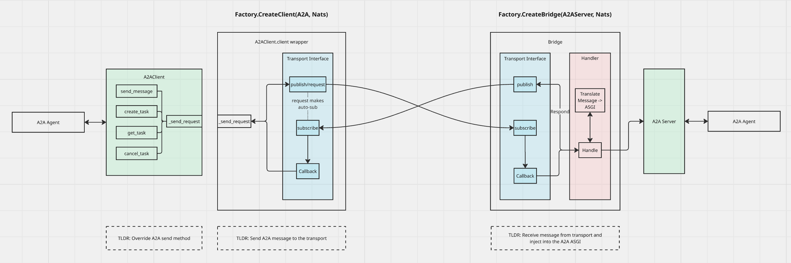
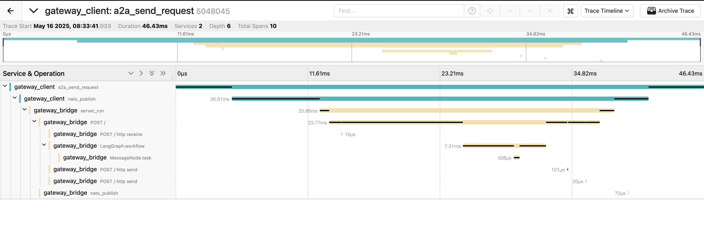

Agent Gateway SDK
========================
A factory package to facilitate agent communcation with various agent protocols / frameworks and transports, decoupling the agent protocol from the transport layer. The package aims to provider interoperability between different agent protocols and messaging layers while providing automatic end-to-end observability.

<div align="center" style="margin-bottom: 1rem;">
  <a href="https://pypi.org/project/your-package-name/" target="_blank" style="margin-right: 0.5rem;">
    
  </a>
  <a href="./LICENSE" target="_blank">
    
  </a>
</div>

---

### 🧠 Supported Agent Protocols
- [x] A2A

### 📡 Supported Messaging Transports
- [x] NATS  
- [ ] AGP *(coming soon)*  
- [ ] MQTT *(coming soon)*  


### Architecture

[]()

## Installation

This project uses [uv](https://github.com/astral-sh/uv) for package management:
```bash
# Install UV if you don't have it already
curl -LsSf https://astral.sh/uv/install.sh | sh
```

Create a new virtual environment and install the dependencies:
```bash
uv venv
source .venv/bin/activate
```

## Getting Started

Create an A2A server bridge with your network transport of choice:
```python
from a2a.server import A2AServer
from gateway_sdk.factory import GatewayFactory

...
server = A2AServer(agent_card=agent_card, request_handler=request_handler)

factory = GatewayFactory()
transport = factory.create_transport("NATS", "localhost:4222", options={})
bridge = factory.create_bridge(server, transport=transport)

await bridge.start()
```

Create an A2A client with a transport of your choice:
```python
from gateway_sdk.factory import GatewayFactory
from gateway_sdk.factory import ProtocolTypes

factory = GatewayFactory()

transport = factory.create_transport("NATS", "localhost:4222", options={})
    
# connect via agent URL
client_over_nats = await factory.create_client("A2A", agent_url="http://localhost:9999", transport=transport)

# or connect via agent topic
client_over_nats = await factory.create_client(ProtocolTypes.A2A.value, agent_topic="Hello_World_Agent_1.0.0", transport=transport)
```

View agent traces from jaeger:
[]()

## Testing

**✅ Test the gateway factory with default A2A client/server**

Run a sample agent via an A2A server:
```bash
uv run python tests/helloworld/__main__.py 
```

In a second terminal, run an A2A test client:
```bash
uv run pytest tests/test_a2a.py::test_a2a_factory_client -s
```

**🚀 Test the gateway factory with A2A over NATS transport**

Run a Nats server and observability stack:
```bash
uv run python gateway_cli/cli.py up
```

Run an A2A server with a NATS bridge:
```bash
uv run python tests/helloworld/__bridge__.py
```

In a second terminal, run an A2A test client with a NATS transport:
```bash
uv run pytest tests/test_a2a.py::test_a2a_factory_client_with_transport -s
```

## Roadmap
- [x] Add support for transport decoupling and usage
- [ ] Add additional protocols
- [ ] Add observability
- [ ] Add authentication and transport security
- [ ] Add AGP control plane integration
- [ ] Add traffic routing via AGP control plane
