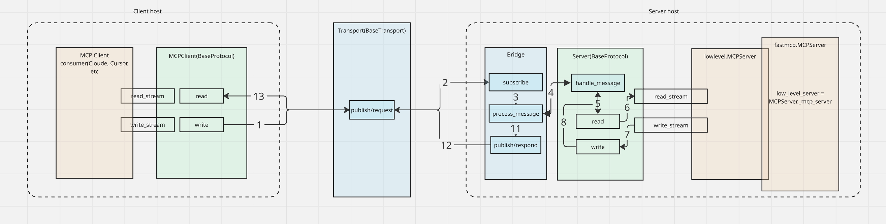
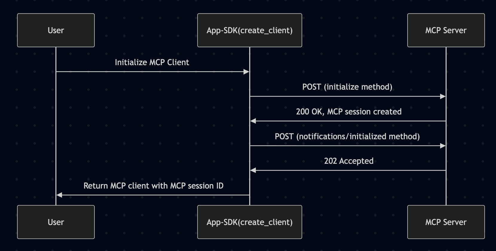

# MCP Usage Guide

In this guide, we will walk through some of the key features of the Agntcy Application SDK and explore an end-to-end example of creating two MCP agents that communicate over a custom transport (SLIM, NATS).

The following diagram illustrates how the MCP protocol maps to a transport implementation:

<p align="center">
  
</p>

The following table summarizes the current MCP and transport support in the Agntcy Application SDK:

| Protocol \ Transport | SLIM | NATS | MQTT |
| -------------------- | :--: | :--: | :--: |
| **MCP**              |  ✅  |  ✅  |  🕐  |

### ⚡️ Connecting an MCP client to an MCP server over an abstract transport (SLIM | NATS)

A benefit of decoupling protocols from transports is that you can easily create agents that communicate over non http, point-to-point transports such SLIM or as NATS. Below is an example of how to create an MCP client and server that communicate over SLIM's dataplane server.

We will use `uv` for package management and virtual environments. If you don't have it installed, you can install it via:

```bash
curl -LsSf https://astral.sh/uv/install.sh | sh
```

Create a new project directory:

```bash
uv init agntcy-mcp
cd agntcy-mcp
```

Install the Agntcy Application SDK and Langgraph:

```bash
uv add agntcy-app-sdk
```

Next we will create a simple weather MCP server that responds to weather queries. Create a file named `weather_server.py` and implement the MCP server. We will then add the server to an app session to serve via a transport of our choice, in this case SLIM.

```python
from agntcy_app_sdk.factory import AgntcyFactory
from agntcy_app_sdk.app_sessions import AppContainer
from mcp.server.fastmcp import FastMCP
import asyncio

# create an MCP server instance
mcp = FastMCP()

# add a tool to the MCP server
@mcp.tool()
async def get_forecast(location: str) -> str:
    return "Temperature: 30°C\n" "Humidity: 50%\n" "Condition: Sunny\n"

# initialize the Agntcy factory
factory = AgntcyFactory()

# create an Agntcy factory transport instance
transport = factory.create_transport("SLIM", endpoint="http://localhost:46357", name="default/default/weather_server")
# transport = factory.create_transport("NATS", endpoint="localhost:4222")

async def main():
    # create an app session and serve the MCP server via an AppContainer
    app_session = factory.create_app_session(max_sessions=1)
    app_container = AppContainer(
        mcp._mcp_server, transport=transport, topic="my_weather_agent.mcp"
    )
    app_session.add_app_container("default_session", app_container)
    await app_session.start_all_sessions(keep_alive=True)

if __name__ == "__main__":
    asyncio.run(main())
```

Next we will create a simple client that queries the weather server. Create a file named `weather_client.py` and request an MCP client via the Agntcy factory:

```python
from agntcy_app_sdk.factory import AgntcyFactory
import asyncio

factory = AgntcyFactory()
transport = factory.create_transport("SLIM", endpoint="http://localhost:46357", name="default/default/weather_client")
# transport = factory.create_transport("NATS", endpoint="localhost:4222")

async def main():
    # Create a MCP client
    mcp_client = factory.create_client(
        "MCP",
        agent_topic="default/default/weather_server",
        transport=transport,
    )
    async with mcp_client as client:
        # Build message request
        tools = await client.list_tools()
        print("[test] Tools available:", tools)

        result = await client.call_tool(
            name="get_forecast",
            arguments={"location": "Colombia"},
        )
        print(f"Tool call result: {result}")

if __name__ == "__main__":
    asyncio.run(main())
```

A few notes about the code above:

- The weather server is not binding to a host and port as the MCP server typically would, rather it is listening on a provided topic via the transport. In the current release, both the clent and server must know of and use the same topic to communicate.

### 🏁 Running the Example

First lets run the SLIM transport server, see the agntcy-app-sdk [docker-compose.yaml](https://github.com/agntcy/app-sdk/blob/main/infra/docker/docker-compose.yaml) or SLIM [repo](https://github.com/agntcy/slim/tree/main).

Now we can run the weather agent server:

```bash
uv run python weather_server.py
```

You should see a log message indicating that the message bridge is running:

```
2025-08-07 09:43:02 [agntcy_app_sdk.transports.slim.transport] [INFO] [subscribe:168] Subscribed to default/default/my_weather_agent.mcp
```

Next, we can run the weather client:

```bash
uv run python weather_client.py
```

You should see a print output with the weather report:

```
Tool call result: meta=None content=[TextContent(type='text', text='Temperature: 30°C\nHumidity: 50%\nCondition: Sunny\n', annotations=None, meta=None)] structuredContent={'result': 'Temperature: 30°C\nHumidity: 50%\nCondition: Sunny\n'} isError=False
```

🚀 Congratulations! You have successfully created an MCP client and server that communicate over SLIM via the agntcy-app-sdk SLIM transport.

For a fully functional multi-agent example integrating A2A, Agntcy, and Langgraph, check out our [coffeeAgntcy](https://github.com/agntcy/coffeeAgntcy).

### 🖥️ + 🐳 Practical Example: Host and Docker resource monitoring

The `examples/mcp/` directory demonstrates how **multiple MCP servers register on different topics** and how **one client can reach each server independently** by targeting its topic. The example uses [psutil](https://github.com/giampaolo/psutil) for host metrics and [docker-py](https://github.com/docker/docker-py) for container metrics.

The examples are packaged as their own `uv` project. Install all dependencies:

```bash
cd examples/mcp
uv sync
```

#### Two servers, two topics

Each server is a standalone process that registers its tools on its own topic:

**Host monitor** (`host_monitor_server.py`, topic `host_monitor.mcp`):

- `get_cpu_usage()` — per-core and overall CPU utilization
- `get_memory_usage()` — RAM total, available, used, percent
- `get_system_summary()` — combined CPU + memory + uptime

**Docker monitor** (`docker_monitor_server.py`, topic `docker_monitor.mcp`):

- `list_containers()` — running containers with name, image, status
- `get_container_stats(container_name_or_id)` — CPU% and memory for one container
- `get_all_container_stats()` — CPU/memory overview for all running containers

Both servers follow the same pattern — create a `FastMCP`, define tools, wire to a transport via `AppContainer`:

```python
mcp = FastMCP()

@mcp.tool()
async def get_cpu_usage() -> str:
    """Return per-core and overall CPU utilization percentages."""
    ...

transport = factory.create_transport(transport_type, endpoint=endpoint, name=name)
app_session = factory.create_app_session(max_sessions=1)
app_container = AppContainer(
    mcp._mcp_server, transport=transport, topic="host_monitor.mcp"
)
app_session.add_app_container("default_session", app_container)
await app_session.start_all_sessions(keep_alive=True)
```

#### One client, multiple topics

The client (`monitoring_client.py`) accepts a `--topics` argument listing the topics to query (defaults to both `host_monitor.mcp` and `docker_monitor.mcp`). For each topic it creates a separate MCP client, lists the available tools, then calls a representative tool if it recognizes one — `get_system_summary` for host monitoring, `list_containers` for Docker monitoring:

```python
async def _query_server(topic, transport_type, endpoint):
    transport = factory.create_transport(transport_type, endpoint=endpoint, ...)
    mcp_client = factory.create_client("MCP", agent_topic=topic, transport=transport)
    async with mcp_client as client:
        tools = await client.list_tools()
        tool_names = [t.name for t in tools.tools]

        if "get_system_summary" in tool_names:
            result = await client.call_tool(name="get_system_summary", arguments={})

        if "list_containers" in tool_names:
            result = await client.call_tool(name="list_containers", arguments={})

# Query both servers from one client process
for topic in topics:
    await _query_server(topic, transport_type, endpoint)
```

#### Running the example

From the `examples/mcp` directory:

```bash
# Terminal 1 — start the host monitor server
uv run python host_monitor_server.py --transport SLIM --endpoint http://localhost:46357

# Terminal 2 — start the Docker monitor server (Docker daemon must be running)
uv run python docker_monitor_server.py --transport SLIM --endpoint http://localhost:46357

# Terminal 3 — run the client (queries both servers via topics)
uv run python monitoring_client.py --transport SLIM --endpoint http://localhost:46357
```

You can also query only one server by passing a single topic:

```bash
uv run python monitoring_client.py --transport SLIM --endpoint http://localhost:46357 --topics host_monitor.mcp
```

> **Note:** Use `--transport NATS --endpoint localhost:4222` for NATS instead of SLIM. See the full source in [`examples/mcp/`](../examples/mcp/).

### ✨ FastMCP Support (Updated: 2025/08/18)

The Agntcy Application SDK now fully supports FastMCP, an enhanced version of the MCP protocol designed for high-performance and concurrent operations. FastMCP introduces additional capabilities such as streamable HTTP transport and optimized initialization flows. Developers can leverage these features seamlessly using the `FastMCPProtocol`.

#### Initialization Flow

The FastMCP client initialization involves two POST requests:

1. **Initialization Request**: Establishes the session and retrieves the `Mcp-Session-Id`.
2. **Notification Request**: Confirms the session initialization.

The following diagram illustrates the initialization flow:

<p align="center">
  
</p>

For more details, refer to the [official documentation](https://modelcontextprotocol.io/specification/2025-06-18/basic/transports#sequence-diagram).

#### Example: Creating and Running a FastMCP Server

```python
import asyncio
from agntcy_app_sdk.factory import AgntcyFactory
from agntcy_app_sdk.app_sessions import AppContainer
from mcp.server.fastmcp import FastMCP

# Create an MCP server instance
mcp = FastMCP()

# Add a tool to the MCP server
@mcp.tool()
async def get_forecast(location: str) -> str:
    """
    Tool to fetch the weather forecast for a given location.

    :param location: The location for which the forecast is requested.
    :return: A string containing the weather forecast.
    """
    return "Temperature: 30°C\nHumidity: 50%\nCondition: Sunny\n"

# Initialize the Agntcy factory
factory = AgntcyFactory()

async def main():
    # Create the transport instance
    transport_type = "SLIM"  # Replace with "NATS" if using NATS transport
    endpoint = "http://localhost:46357"  # Replace with your transport endpoint
    transport = factory.create_transport(transport_type, endpoint=endpoint)
    print(f"[setup] Transport created: {transport_type} | Endpoint: {endpoint}")

    # Create an app session and serve via AppContainer
    app_session = factory.create_app_session(max_sessions=1)
    app_container = AppContainer(
        mcp._mcp_server, transport=transport, topic="test_topic.mcp"
    )
    app_session.add_app_container("default_session", app_container)
    print("[setup] App session created with topic: test_topic.mcp")

    # Start the session
    print("[start] Starting the app session...")
    await app_session.start_all_sessions(keep_alive=True)

if __name__ == "__main__":
    asyncio.run(main())
```

#### Default Port Configuration

The FastMCP server uses **port 8081** by default to avoid conflicts with other common ports like 8000. However, you can configure the port by setting the `FAST_MCP_PORT` environment variable.

For example, to change the port to 9090, you can run:

```bash
export FAST_MCP_PORT=9090
```

Then, start your server as usual. The server will now listen on port 9090.

#### Example: Creating a FastMCP Client

The `FastMCPProtocol.create_client` method allows you to create an MCP client for interacting with a FastMCP server. Below is an example demonstrating its usage, including the `route_path` parameter.

```python
from agntcy_app_sdk.protocols.fast_mcp.protocol import FastMCPProtocol
from agntcy_app_sdk.factory import AgntcyFactory
import asyncio

async def main():
    protocol = FastMCPProtocol()
    slim_transport = AgntcyFactory().create_transport("SLIM", endpoint="http://localhost:46357")

    # Create a FastMCP client
    client = await protocol.create_client(
        url="http://localhost:8081",
        topic="weather_agent.fastmcp",
        transport=slim_transport,  # Optional transport instance
        route_path="/custom-path",  # Custom route path for the client
        auth="your-bearer-token",  # Optional authentication
    )

    async with client as mcp_client:
        tools = await mcp_client.list_tools()
        print("Available tools:", tools)

        result = await mcp_client.call_tool(
            name="get_forecast",
            arguments={"location": "Colombia"},
        )
        print("Forecast result:", result)

if __name__ == "__main__":
    asyncio.run(main())
```

For more details, refer to the [FastMCP API Reference](https://modelcontextprotocol.io/specification/2025-06-18/basic/transports#sequence-diagram).

### Identity TBAC Integration

Activate Agntcy Identity Service TBAC by configuring the `IDENTITY_AUTH_ENABLED` and `IDENTITY_SERVICE_API_KEY` environment variable with the Identity App Service API key.  
For more details, refer to the [official documentation](https://identity-docs.outshift.com/docs/dev#mcp-integration-using-the-python-sdk).

**Important**: Ensure the `IDENTITY_SERVICE_API_KEY` values for the client and server are different to enforce proper TBAC functionality.

### ⚙️ Contributing additional Transports

To contribute a new transport implementation, follow these steps:

1. **Implement the Transport Interface**: Create a new class for your transport in the `src/agntcy_app_sdk/transports` directory. Ensure it inherits from the `BaseTransport` interface and implements all required methods.

2. **Update the Factory**: Modify the `AgntcyFactory` to include your new transport in the `create_transport` method.

3. **Add Tests**: Create unit tests for your transport in the `tests/e2e` directory. Ensure all tests pass.

4. **Documentation**: Update the documentation to include your new transport. This includes any relevant sections in the README and API reference.

5. **Submit a Pull Request**: Once your changes are complete, submit a pull request for review.

See [API Reference](API_REFERENCE.md) for detailed SDK API documentation.
